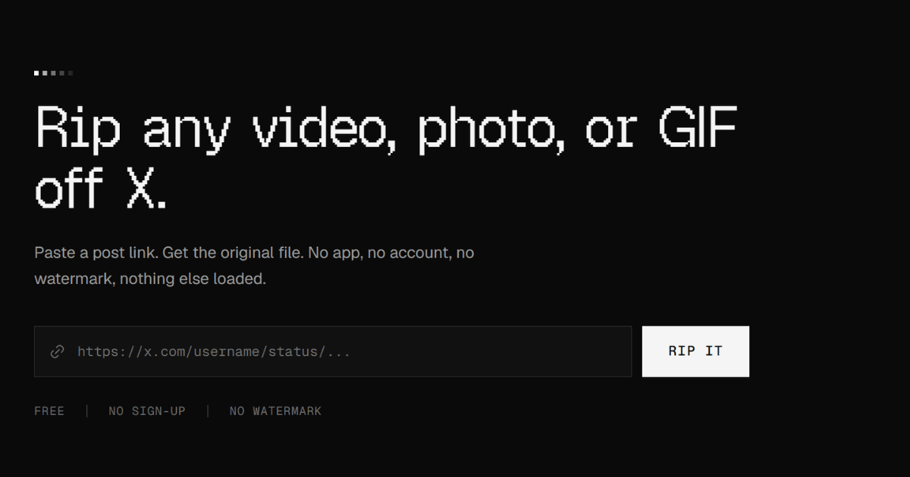

<div align="center">



<h1>RipTweet</h1>

<p><b>Rip any video, photo, or GIF off X.</b><br/>Paste a link. Get the original file. Nothing else.</p>

<p>
  
  
  
  
</p>

<p>
  <a href="http://riptweet.netlify.app"><b>Live site</b></a> ·
  <a href="#getting-started">Getting started</a> ·
  <a href="#faq">FAQ</a>
</p>

</div>

---

## What it does

Paste the link to a post on X. RipTweet reads the post, finds the video, photo, or GIF inside it, and hands back the original file — full resolution, no re-encoding, no watermark. Nothing else about the post is shown: not the reply count, not the avatar, not the timeline sitting around it.

## Features

- **Original quality, every time** — files come straight from the servers X already hosts them on. No re-encoding, no extra compression.
- **Nothing else loads** — only the media renders, never the rest of the post.
- **Runs in your browser** — no app to install, no account to create, no API key to configure.
- **Nothing is kept** — links and files aren't logged or stored; each request lives only as long as it takes to serve it.
- **Light & dark, end to end** — theming carries through to the favicon set and the manifest.
- **Accessible by default** — skip-to-content link, ARIA labelling, and a keyboard-friendly layout throughout.
- **Built for discovery, not just humans** — JSON-LD (`WebApplication`, `HowTo`, `FAQPage`) so search engines and AI answer engines can describe it accurately.

## Supported assets

| Asset | What you get |
|---|---|
| **Video** | The original MP4, in every resolution X stored for it — up to 4K when the uploader posted that high |
| **Photo** | Full original resolution, not the cropped, compressed preview a timeline shows |
| **GIF** | The same silent, looping MP4 X already stores it as |

## How it works

1. **Paste the link** — copy a post's URL from the Share icon or the address bar.
2. **Pick a file** — RipTweet shows only the media inside the post; choose a quality if more than one is offered.
3. **Save it** — the file downloads straight to your device at its original quality. No extra steps.

## Tech stack

- [Next.js](https://nextjs.org) — App Router, React Server Components
- [TypeScript](https://www.typescriptlang.org)
- [Tailwind CSS](https://tailwindcss.com)
- [lucide-react](https://lucide.dev) for iconography
- [Radix UI](https://www.radix-ui.com) primitives
- Structured data (`WebApplication`, `HowTo`, `FAQPage`) for SEO/AEO

## Getting started

```bash
git clone https://github.com/subhadeeproy3902/x-video-downloader.git
cd x-video-downloader
npm install
npm run dev
```

Then open [http://localhost:3000](http://localhost:3000). No environment variables or API keys are required — RipTweet reads public post data the same way X's own embed widget does.

Before deploying, update the site metadata (name, canonical URL, social handles, keywords) in one place so titles, Open Graph tags, and structured data all stay in sync.

## Deployment

Deploys cleanly to [Vercel](https://vercel.com) with zero configuration.

[](https://vercel.com/new)

## FAQ

**Do I need an X or Twitter account?**
No. RipTweet reads public post data the same way X's own embed widget does, so no login or API key is required.

**What's the highest quality I can get?**
Whatever the uploader posted — video at the highest bitrate X stored for that post, photos at their full original resolution.

**Does it work on a phone?**
Yes. Open it in your phone's browser, paste the link, and download. iOS prompts you to save the file; on Android it lands in Downloads.

**Is RipTweet affiliated with X?**
No. It's an independent project, not affiliated with, endorsed by, or sponsored by X Corp.

## Privacy & legal

RipTweet doesn't log the links you paste or store the files it serves. Saving a copy for personal use is generally fine; redistributing someone else's video or photo without permission can violate copyright or X's own terms, so get permission before sharing it further.

## Contributing

Issues and pull requests are welcome. For anything beyond a small fix, open an issue first so we can agree on the approach before you put the work in.

## License

MIT © [Riptweet](./LICENSE)

## Authors

- [Subhadeep Roy](https.//x.com/mvp_Subha)
- [Khushi Chetule](https://x.com/khushiirl)

---